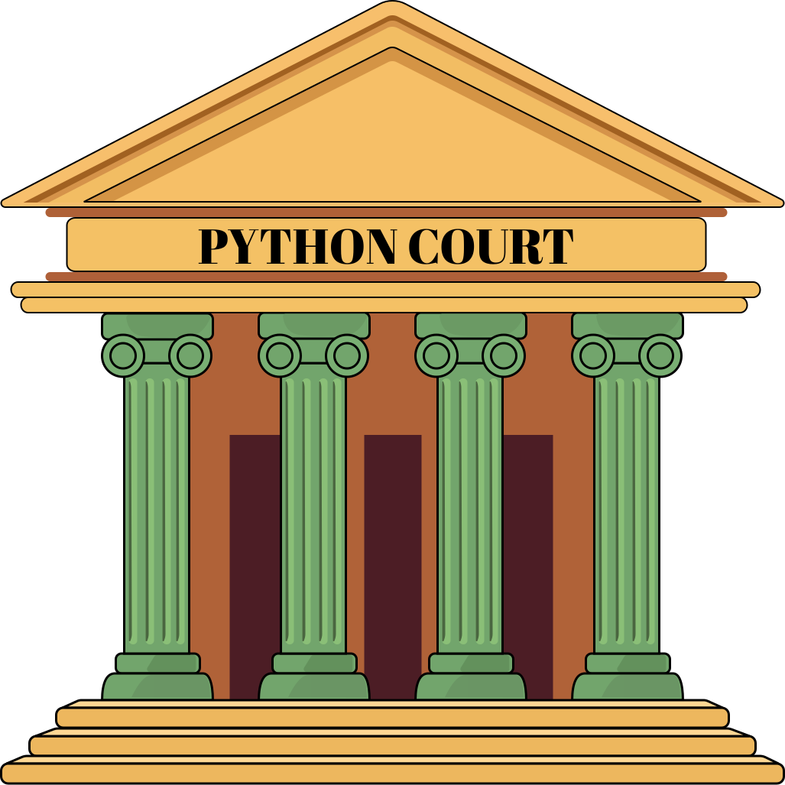

<div align="center" markdown="1">

<a href="https://pythoncourt.com">
    
</a>

<h1>PythonCourt</h1>
<h3>基于 AST 分析和 Rule 系统的 Python 代码审计引擎</h3>
<p>在 AI 生成的狂野西部，寻找法律与秩序的可能性。</p>
<br>


[](https://pythoncourt.com)
[](../guide/started/index.md)
[](../../README.md)

</div>


---

## 📖 品牌故事：从“被 AI 编程”到“约束 AI 编程”

### **痛点｜修复循环**

AI 让不懂代码的我也能写程序了，但在缺乏规则的情况下，生成的代码充满隐蔽 bug、循环依赖和架构坏味道。我发现不是在创造，而是在不断修复 AI 留下的问题。

### 觉醒｜需要法律，而不是更多提示词

这既不是单纯的 AI 问题，也不是仅靠 Prompt 就能完全解决的。问题在于缺乏一套可定义、可解释、可重复的约束机制。我将反复遇到的问题整理成各种laws并整合为PyCourt，将其与 Pyright、Mypy、Bandit、Ruff 等成熟工具编排成自动化流程，逐渐形成了 PythonCourt 这一方法体系。

现在，我让 AI 审计自己生成的代码，确保通过后才能进入仓库。代码不再只是“能跑”，而是被约束在明确的工程边界之内。

### 邀请｜共同完善这套体系

我仍然在学习。开源的 PyCourt，并不是一个完成品，而是希望邀请更多开发者一起改进它。现有的 laws 可能仍然粗糙，也可能遗漏了重要问题。如果你发现误判、漏判，或认为某种坏味道值得被正式定义，欢迎参与进来。这不是一套宣判对错的系统，而是一种寻找可持续的秩序的尝试。

---

## ⚖️ 法典总览：那些反复破坏工程秩序的坏味道

下表列出的是为在实践中总结的一些 **PyCourt Laws**。
它们并非语言层面的语法错误，而是我在实践中反复遇到、并最终导致代码**难以理解、难以维护或难以演进**的结构性问题。

这些规则主要关注：

* **架构边界**：模块是否站在正确的层级
* **依赖关系**：是否存在隐蔽的耦合与反向依赖
* **类型纪律**：是否通过 Any / dict / object 等方式逃避约束
* **可调配置**：是否绕过统一的规则与参数来源
* **虚假测试**：测试是否真的在验证行为，而不是制造安全感


| 严重程度 | 法典编号  | 违规行为 | 工程描述 |
|:----:|:----:|:----|:------|
| 🔴 | **TC001** |  进口走私罪 | 使用`TYPE_CHECKING`等手段掩护循环依赖 |
| 🔴 | **RE001** |  门面僭越罪 | 前台接待`__init__.py`越权处理公司核心业务 |
| 🔴 | **DI001** |  底层僭越罪| 臣子竟敢直接依赖皇帝的具体谕令而非圣旨规范 |
| 🔴 | **UW001** |  账目混乱罪 | 会计私自开启/关闭账本而不通过财务总监审批 |
| 🔴 | **BC001** |  非法越境罪 | 原始数据(dict/list)携带假护照跨越领域边界 |
| 🔴 | **VT001** |  信号干扰罪 | 事件处理系统擅自修改协议规定的信号频率 |
| 🔴 | **AC001** |  类型诈骗罪 | Any、cast、dict 扮演多重身份欺骗类型系统 |
| 🔴 | **OU001** |  裸奔伤风罪 | 代码中的object赤身裸体，毫无领域身份标识 |
| 🟠 | **DT001** |  时间伪造罪 | 程序擅自冻结、加速或伪造宇宙时间常量 |
| 🟠 | **SK001** |  技能冒用罪 | 未持有合格技能证书(SkillID)擅自调用专业能力 |
| 🟡 | **DS001** |  沉默寡言罪 | 公共接口故作高深，拒绝提供使用说明书 |
| 🟡 | **LL001** |  化简为繁罪 | 函数变身俄罗斯套娃，循环嵌套深度堪比盗梦空间 |
| 🟡 | **HC001** |  到此一游罪 | 将魔法数字和神秘字符串刻在代码石碑上永世流传 |
| 🟡 | **HC002** |  散兵游勇罪 | 常量值如逃兵般散落各地，拒绝加入正规军(类/枚举) |
| 🟡 | **PC001** |  暗度陈仓罪 | 配置参数试图绕过官方认证通道(RuleProvider) |
| 🔵 | **TP001** |  狐假虎威罪 | 测试用例演技浮夸，看似努力实则毫无实际贡献 | 

---
<small>严重程度：🔴 阻断级（必须修复） → 🟠 高风险(建议修复) → 🟡 可接受（但需警惕） → 🔵 轻度 / 提示性</small>

每一条 law 都对应一个明确的 **违规模式**，并可被自动检测。

严重程度仅用于**排序与阻断策略**，并不等同于代码“好坏”的道德判断。

---


## ⚔️ 军械架构：一套可编排的自动化防御体系

PythonCourt 并不是单一工具，而是一套**分层协作的审计与裁决体系**。
每一层各司其职，共同决定一段代码是否能够进入系统边界。

### ⚖️ PyCourt（核心引擎）

* **能力**：基于 AST 与 rules，对 Python 代码进行结构性与架构级审计
* **职责**：AI 可以生成“能运行的代码”，但 PyCourt 负责判断它是否**符合工程秩序**

---

### 🧭 Weapon（编排与裁决层）

* **能力**：将 PyCourt 的 laws 与 Mypy、Pyright、Ruff、Bandit 等工具编排而成的武器
* **职责**：定义审计级别、执行顺序与阻断策略，并给出**最终裁决结果**

---

### 🛠️ Workflow（工作流层）

* **能力**：针对文件、目录与模块级别，设计并组合不同的审计策略
* **职责**：根据开发节奏与风险等级，形成可复用、可演进的审计工作流

---


## 🧩 安装与配置：定制你的最高法院

1️⃣  PyCourt 已发布为独立 Python 包，当前在 **Python 3.11–3.14** 上验证通过。

```bash
# 推荐：在项目虚拟环境中使用
pip install pycourt
```

2️⃣ 安装完成后，在项目根目录初始化,这会在根目录生成 `pycourt.yaml` 配置文件，作为整个裁决体系的**唯一真实来源**。

```bash
pycourt init
```
---

3️⃣ 【高级玩法但非常推荐】在 `pyproject.toml` 里新增并配置你的项目路径后可直接运行，以下配置示例：
```toml
[tool.pycourt]
civilized_paths = [
  "src/api",
  "src/domain",
  "src/services",
  "src/infra",
]

coverage = 85 # 测试覆盖率阈值(%)
```

这套配置哲学：声明式治理优于事后检查。你定义文明区，PythonCourt守护边界。

---

## 🚀 快速开始：完成一次裁决

### 1️⃣ 选择一把“武器”

根据当前开发阶段，选择合适的审计脚本：

* 匕首：单文件快速校验
* 军刀：模块级结构审计
* 节仗：项目级跨域模块

👉 [查看并下载武器脚本](../script/official/index.md)

---

### 2️⃣ 启动审计

执行脚本后，系统将按既定顺序统一调度：

* PyCourt（架构与规则审计）
* Mypy / Pyright（类型系统）
* Ruff / Bandit（风格与安全）

所有结果在同一裁决上下文中汇总。

---

### 3️⃣ 接受或驳回

* ❌ 存在阻断级违规，裁决失败
* ✅ 全部通过，代码才具备进入主分支的资格

PythonCourt 不修代码，它只回答一个问题：

**这段代码，是否值得存在。**

---

## 📜 判决书，而不是日志

PythonCourt 不输出零散的检查日志。
它输出的是一份**结构化、可执行、可复审的判决结果**。每一条违规都对应一位“法官”，并给出：

示例（节选）：

```yaml
# DI001法官的判决输出
  DI001:
    template: |
      🏛️ 依赖倒置审查官（DI001）: 检测到可疑的跨模块/组件依赖
      📋 违规导入: app.services.order_service -> app.infra.db.session
      💡 建议: 优先依赖抽象（接口/协议）而非具体实现
      🔧 快速修复: 为该依赖抽象出接口，并通过依赖注入完成装配
```

这意味着：

* AI 可以**看懂自己的错误**
* 人可以**判断是否接受裁决**
* CI 可以**基于严重程度直接阻断**

PythonCourt 关心的不是“有没有问题”，而是**这段代码是否配得上进入系统边界**。

---

## 🚫 不要使用 PythonCourt

### ❌ 这些场景下，先别用 PythonCourt

- **只关心“能跑就行”**
如果当前目标只是快速验证想法、写一次性脚本，或交付生命周期极短的原型，
PythonCourt 的裁决会显得“过于严格”。

- **希望工具自动替你“修好代码”**
PythonCourt 不生成代码、不自动重构，也不试图掩盖设计问题。
它只负责裁决，不负责安慰。

- **还没有基本的工程边界意识**
如果项目尚未区分领域、接口、基础设施，
那么 PythonCourt 只会不断提醒你“这里还不是文明社会”。

- **把 AI 当成外包，而不是协作者**

AI 写代码，但人类必须对结构、边界和长期质量负责。
如果你期待 AI 独立完成工程决策，这套体系会显得多余。


### ✅ 这些情况下，PythonCourt 适合你：

* 在用 AI 编写**生产级代码**
* 开始感受到“修复循环”和结构退化
* 愿意为代码引入明确的法律、边界和裁决流程
* 接受：**有些代码应该被拒绝存在**

PythonCourt 不是效率工具。它是一种工程立场。

来这里讨论 👉 [架构前置的意义和方法](https://github.com/orgs/PythonCourt/discussions/2)

---

## 🔧 参与开发与治理
PythonCourt 不是工具，它是一场关于代码秩序的方法论。
如果你希望参与规则设计、审计算法、或跨平台工具链建设，可以：
1. 只改 PyCourt 自己（贡献/调试引擎）
```bash
   git clone https://github.com/PythonCourt/pycourt.git
   cd pycourt
   poetry install

   # 在本仓库里直接运行
   poetry run pycourt scope pycourt
   poetry run ./qa.sh
```
2. 在自己的项目里本地依赖 PyCourt（和我一样）
```toml
# 你的项目 pyproject.toml
[tool.poetry.dependencies]
pycourt = { path = "../PyCourt", develop = true }
```
3. 在你的项目里使用 pycourt
```bash
   poetry install  # 初始化配置文件
   poetry run pycourt scope . # 审计你的项目
```

更多内容请阅读：👉 [参与治理与贡献指南](../guide/community/contribute.md)

---

<div align="center" markdown="1"> 
<br><br>
<br>
<p>
PythonCourt 不保证写出好代码<br>
它只试图让坏代码，没那么容易留下来<br>
如果你也在和 AI 一起写需要长期维护的系统<br>
欢迎把这里当作一次持续的工程实验
</p>
<br>
  
<br><br>
<p><strong>让AI写出生产级代码</strong></p>
</div>


